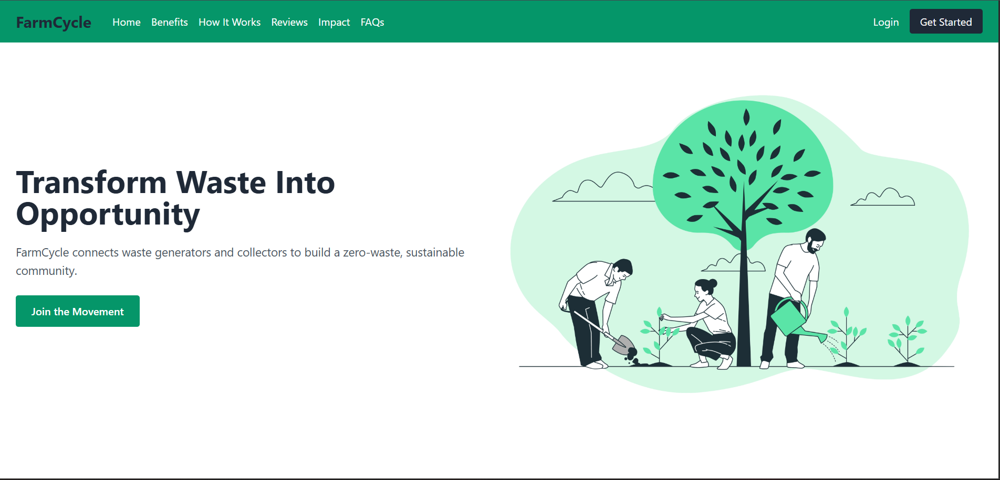
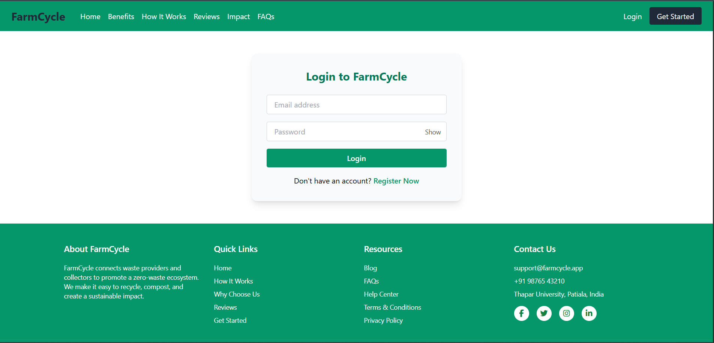

# FarmCycle

*FarmCycle* is a hyperlocal web platform that connects food waste providers (like households, cafes, and hostels) with waste collectors (like farmers, gardeners, NGOs). Our goal is to build a zero-waste, sustainable ecosystem that promotes composting and responsible waste management — one neighborhood at a time.

🌐 *Live Site:* [https://farmcycle.vercel.app](https://farmcycle.vercel.app)

---

## Screenshots

| Landing Page | Login Page |
| ---------- | -------------------- |
|  |  |

| Provider Dashboard | Provider Listings | Provider Requests |
| ------------------ | ------------------- | ------------------- |
|  |  |  |

| Collector Browse | Collector Claim |
| --------------- | --------------- |
|  |  |

---

## 🌟 Unique Features

- **Two-sided ecosystem:** Distinct dashboards for providers and collectors.
- **Hyperlocal matching:** Easily connect with waste partners nearby.
- **Simple listings:** Providers can quickly list food waste with quantity and pickup details.
- **Notifications and history:** Track real-time requests, updates, and past activities.
- **Role-based access:** Users can register as individuals or organizations and access tailored features.
- **Built for sustainability:** Designed with a zero-waste, scalable vision.

---

## Tech Stack

### 🖼 Frontend (Client-side)

| Tech/Library            | Purpose                                                   |
| ----------------------- | --------------------------------------------------------- |
| React.js                | Main frontend framework                                   |
| React Router DOM        | Client-side routing/navigation                            |
| Axios                   | HTTP requests to backend                                  |
| Tailwind CSS            | Utility-first CSS framework for styling                   |
| React Context API       | Global state management for authentication/user info      |
| React Toastify          | Toast notifications for status messages                   |
| Leaflet + React-Leaflet | Interactive maps for selecting and viewing locations      |
| leaflet-geosearch       | Location search with OpenStreetMap (manual pin selection) |

### 🧠 Backend (Server-side)

| Tech/Library | Purpose                                               |
| ------------ | ----------------------------------------------------- |
| Node.js      | Backend runtime environment                           |
| Express.js   | Web framework to define routes and API endpoints      |
| MongoDB      | NoSQL database to store users, listings, claims, etc. |
| Mongoose     | ODM (Object Data Modeling) library for MongoDB        |
| bcryptjs     | Hashing passwords securely                            |
| jsonwebtoken | Secure authentication via tokens                      |
| Multer       | Handling file uploads (e.g., profile pictures)        |
| dotenv       | Managing environment variables                        |
| CORS         | Cross-Origin Resource Sharing setup                   |

### 📃 Database

| Tool               | Purpose                                        |
| ------------------ | ---------------------------------------------- |
| MongoDB Atlas      | Cloud-hosted MongoDB cluster                   |
| GeoJSON / 2dsphere | Location-based indexing for geospatial queries |

### ☁️ Deployment & Cloud Services

| Tool          | Purpose                                          |
| -----------   | ------------------------------------------------ |
| Vercel        | Hosting frontend (React app)                     |
| Render        | Hosting backend (Express server) – if applicable |
| MongoDB Atlas | Cloud-hosted database                           |
| Cloudinary    | Cloud image storage for user-uploaded images     |

---

## 🔧 Getting Started

### 📁 Clone the repository:
bash
git clone https://github.com/FarmCycle-org/farmcycle.git
cd farmcycle

### ⚙ Backend Setup:
bash
cd server
npm install
npm run dev

### 💻 Frontend Setup:
Open a new terminal:
bash
cd client
npm install
npm start

### 🔑 Environment Variables

Create a .env file in the server folder and add:

env
MONGO_URI=your_mongodb_connection_string
JWT_SECRET=your_jwt_secret
